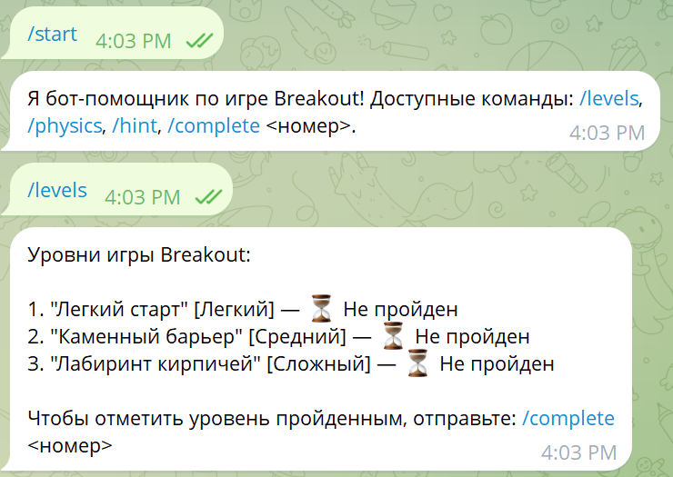
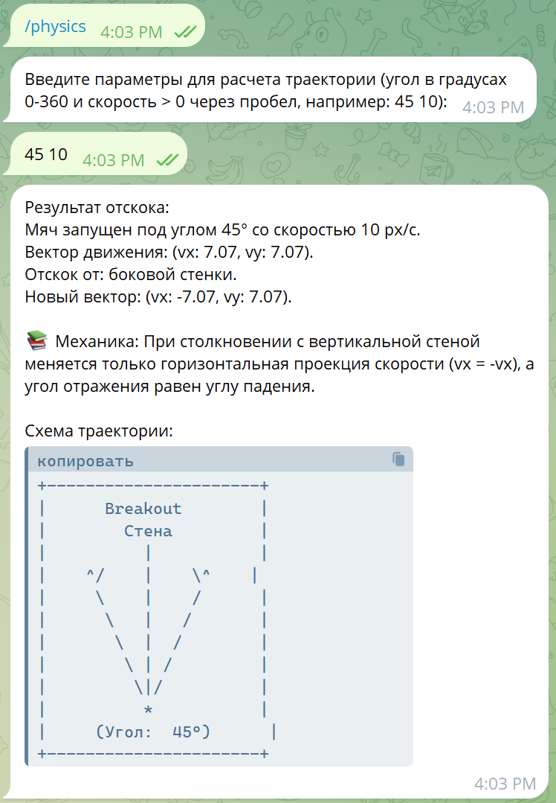
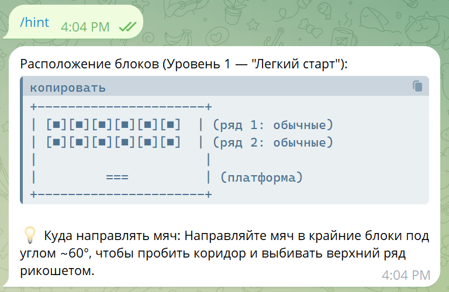
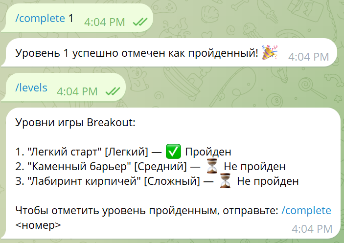

# BreakoutBot — Помощник по игре «Брейкаут»

Учебный Telegram-бот, разработанный в рамках Лабораторной работы №3. Бот помогает игрокам изучать механику игры «Breakout»: рассчитывает физику отскоков мяча, хранит информацию об уровнях сложности и выдает подсказки по прохождению.

## Команды бота
- `/start` — приветствие и список основных команд
- `/levels` — просмотр списка уровней и прогресса игрока
- `/physics` — запуск пошагового конечного автомата для расчета отскока мяча по углу и скорости
- `/hint` — подсказка по расположению блоков на текущем уровне

## Запуск проекта

1. Установка зависимостей:
   \`\`\`bash
   npm install
   \`\`\`

2. Создайте файл `.env` на основе `.env.example` и укажите токен Telegram:
   \`\`\`env
   TELEGRAM_BOT_TOKEN="ВАШ_ТОКЕН"
   \`\`\`

3. Запуск бота:
   \`\`\`bash
   npm start
   \`\`\`

4. Проверка линтера и тестов:
   \`\`\`bash
   npm run lint
   npm run test:coverage
   \`\`\`

## Примеры работы

